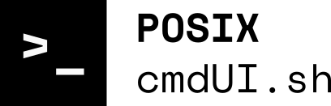
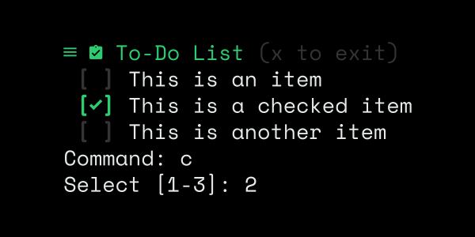
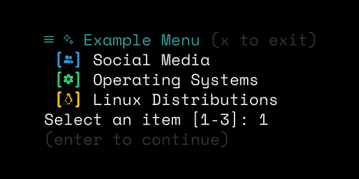

<div align=center></div>

# cmdUI.sh

`cmdUI.sh` is a script written in POSIX shell, to build aesthetic cli interfaces inside shell scripts.

The script is made of different modules, each module can be accesed as a function once the `cmdUI` script is sourced in a shell script.

#### Example:
```sh
#!/bin/sh
. ./cmdUI.sh
cmdItem "$(cmdAnsi n F g)" "This is an example"
```
## Module selection

By default the `cmdUI` script contains all available modules. The script can be compiled using the `cmdCompile` utility to contain only ceritain modules or other custom ones. Beware that some modules are dependent on others.

```sh
$ ./utilities/cmdCompile.sh modules/cmdAnsi.sh /path/to/module
```
## Module info

Each module has its own usecase and features, to know how to use each module you can view its source code or print its info page using the `cmdHelp` utility, introducing the name of the module.

```sh
$ ./utility/cmdHelp cmdAnsi
```

## Available modules

- Standalone:
  - `cmdAnsi.sh` - A module for working with ANSI colors more intuitively
  - `cmdItem.sh` - A module for printing strings in a versatile manner
- Compound:
  -  `cmdMenu.sh` - A module for creating menus
  -  `cmdChecklist.sh` - A module for creating checklists _(not fully POSIX, uses GNU features)_

_Standalone_ modules don't depend on other modules.
_Compounnd_ modules are made of smaller standalone modules.

## Examples
### To-do script
Small To-do script made with the `cmdChecklist` module, `c` command stands for "check"

<div align=center></div>

### Simple menu
Simple menu displaying a few items, made with the `cmdMenu` module.

<div align=center></div>

## Contributing

You can contribute to the project by using it in your scripts or by creating and uploading your own modules.